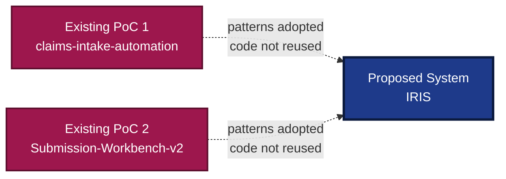
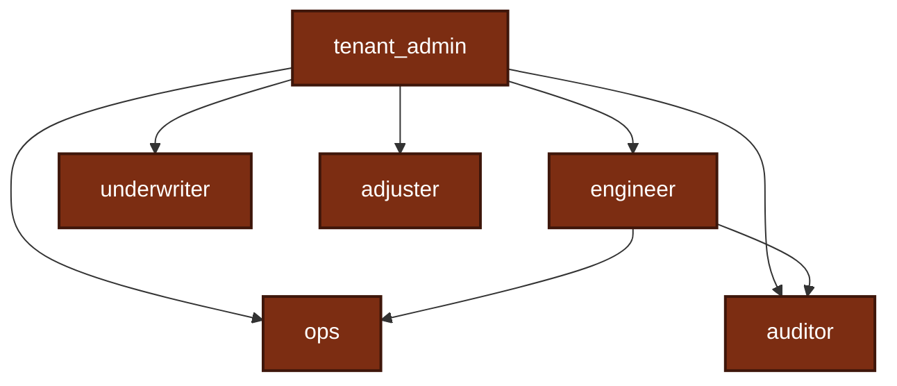
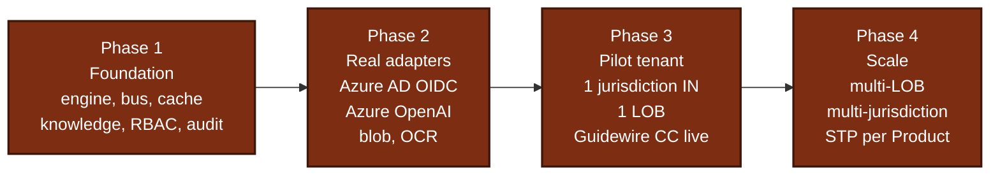

# IRIS (Insurance Reference Intelligence Stack)

## Architecture Proposal

This document proposes the architecture for **IRIS**, the **Insurance Reference Intelligence Stack**. It describes the design we intend to build, the reasoning behind each load-bearing decision, and how the proposal relates to the two proofs-of-concept that already exist in our workspace (`claims-intake-automation` and `Submission-Workbench-v2`).

The intent is to take the patterns those PoCs validated and place them on a foundation that an insurer can actually onboard against: multi-tenant from the first commit, typed contracts at every external boundary, audit-first, and configuration-driven.

---

## 1. Executive Summary

Two PoCs are in place today. Both prove that the mechanism works (LLM-assisted document classification, field extraction, summarization, and a reviewer surface). Neither is shaped like something an insurer can put into production. They share copy-pasted agent code, hard-wire a single LLM endpoint, hand-roll authentication, and assume a single tenant.

**The proposal is a clean replatform under the IRIS name.** The PoCs remain as reference implementations of the patterns we will adopt. The new code will be built spec-first, with the following properties from the first commit:

1. **Multi-tenant by construction.** Every row, every cache key, every event carries a tenant identifier; isolation is enforced at the database layer.
2. **Typed contracts at every external boundary.** Every LLM provider, OCR engine, blob store, identity provider, system-of-record, and outbound API is a Protocol with at least two implementations (in-memory for tests, real adapter for production).
3. **Audit-first.** Every workflow transition writes one event to a hash-chained ledger. The chain is verifiable end-to-end.
4. **Configuration-driven onboarding.** Each line of business and jurisdiction is a YAML "Product bundle" rather than a code change. Target onboarding metric: two weeks per new Product.
5. **Regulator-aware.** IRDAI compliance for India (region pinning, data residency, retention), DPDP / GDPR alignment, SOC 2 / ISO 27001 lanes.



---

## 2. Context: The Existing PoCs

### 2.1 `claims-intake-automation`

A FastAPI backend that handles First Notice of Loss (FNOL). It contains a small set of agents in `backend/agents/` (document classifier, field extractor, claim summary), a Guidewire integration in `backend/services/guidewire_mapper.py`, and a hand-rolled JWT authentication router in `backend/routers/auth.py`.

Patterns that work well:

- The decomposition of intake into classify, extract, and summarize.
- The FNOL field set and classification taxonomy.
- The reviewer worklist shape.
- The Guidewire composite request idea.

Properties that prevent it from shipping as-is:

- The authentication router auto-generates a JWT secret when `JWT_SECRET` is unset (`secrets.token_hex(32)`). This is acceptable for a Replit demo and unacceptable for production.
- There is no tenant identifier on any table. The `User` model has `email` and `password_hash` only.
- LLM calls go directly to Azure OpenAI through `backend.infra.llm.azure_openai.get_azure_openai_llm`. There is no region pin, PII redaction, cost cap, or fallback.
- The Guidewire mapper is bespoke to Guidewire. Pointing at a different system-of-record would require writing a parallel mapper.
- Audit consists of `logging` calls.

### 2.2 `Submission-Workbench-v2`

A FastAPI backend with a React + CopilotKit frontend, oriented around submission underwriting. Agents in `backend/agent/` cover appetite checking, classification, field extraction, loss-run analysis, and email drafting. The frontend uses CopilotKit for the chat surface and LangChain for the agent runtime.

Patterns that work well:

- Chat-first interaction for adjusters and underwriters.
- Document-anchored evidence panels.
- Agent decomposition for submissions (appetite, classification, extraction, loss runs).

Properties that prevent it from shipping as-is:

- Vendored UI shell (CopilotKit) sits in the trust path of underwriting actions.
- LangChain abstractions add behavior that is hard to audit and harder to swap.
- Same single-tenant, direct-LLM, ad-hoc-audit posture as the first PoC.

### 2.3 What Both PoCs Share

The clearest signal of the gap: `backend/agents/document_classifier.py` in `claims-intake-automation` and `backend/agent/document_classifier.py` in `Submission-Workbench-v2` are byte-for-byte identical. Code was duplicated across the two repositories because there is no shared library to hold it.

| Concern | Both PoCs |
|---|---|
| Backend framework | FastAPI |
| LLM access | Direct calls to Azure OpenAI |
| Tenancy | Single-tenant |
| Authentication | Hand-rolled JWT or none |
| Audit | `logging` statements |
| Persistence | SQLAlchemy without row-level security |
| Agent contract | Free-form Python functions, ad-hoc Pydantic models |
| Configuration | Hard-coded paths and environment variables |

### 2.4 Gap Analysis

The PoCs validate ideas. The gap between an idea and a deployable insurance platform consists of:

1. Multi-tenancy.
2. A real identity story (OIDC against an enterprise IdP, not hand-rolled JWT).
3. A model gateway (region pin, PII redaction, cost cap, retry, audit).
4. A vendor-neutral system-of-record abstraction.
5. A tamper-evident audit chain.
6. A shared engine that ends the copy-paste pattern.
7. A configuration-driven onboarding path rather than per-tenant code.

IRIS addresses these directly.

---

## 3. Proposed Approach

### 3.1 Design Principles

Five principles that drive every other decision in this document.

1. **One engine, no copies.** All business logic lives in `iris-engine`. Apps and adapters consume it; they never duplicate it.
2. **Typed contracts at every external boundary.** A boundary the engine cannot describe with a Protocol is a boundary the engine cannot test in isolation. Therefore every boundary gets one.
3. **Tenant context flows through every call.** No global state. No request-scoped singletons that erase tenancy.
4. **HITL by default, STP by opt-in.** Straight-through processing is a per-Product configuration choice, not an architecture default. The default is a human reviewer.
5. **Audit-first.** Every state transition is an event. Every event extends a hash chain.

### 3.2 What We Plan to Keep from the PoCs

| From the PoCs | How IRIS Will Adopt It |
|---|---|
| Agent decomposition (classify, extract, summarize) | Formalized in `iris-agents` with one typed contract per agent. |
| FNOL field set and classification taxonomy | Lifted into YAML Product bundles. Same data, configuration-driven home. |
| Reviewer worklist shape | Reused as the workbench's HITL queue. |
| Chat-first interaction | Reused with a custom React chat over a defined AG-UI contract. |
| Guidewire composite mapper idea | Generalized as the `SystemOfRecord` Protocol with a `target_kind` discriminator. Guidewire becomes one implementation; the next SoR is another. |

### 3.3 What We Plan to Replace

| From the PoCs | Reason for Replacement | IRIS Approach |
|---|---|---|
| Copy-pasted agent code across two repos | Drift is inevitable. Bug fixes never make it to both. | Shared `iris-engine` + `iris-agents`. One source of truth. |
| Direct Azure OpenAI calls | No region pin, no redaction, no cost cap. | Model Gateway decorator over any `LLMProvider`. |
| Hand-rolled JWT auth | Auto-generated secrets are a hard no for production. | OIDC adapter against Azure AD / Entra ID. |
| LangChain runtime | More magic than the scope justifies; hard to audit. | Thin agents over a typed `LLMProvider` Protocol. |
| CopilotKit | Vendored UI shell in the trust path. | Custom React chat over the AG-UI contract (Spec 006). |
| Bespoke Guidewire mapper | Cannot point at a second SoR without a parallel implementation. | `SystemOfRecord` Protocol; per-vendor adapter. |
| Single-tenant data model | Cannot host more than one customer. | `tenant_id` as the leading column of every primary key. Row-level security on every table. |

---

## 4. Proposed Architecture

### 4.1 Layered Component View

Four layers. Each layer talks only to the layer directly below it.

```mermaid
flowchart TD
    subgraph APPS["apps/"]
        A1[iris-api<br/>FastAPI]
        A2[iris-worker<br/>arq runners + bus subscribers]
        A3[iris-workbench<br/>React + custom chat]
    end
    subgraph PKGS["packages/iris-*"]
        E1[iris-engine<br/>contracts, types, workflow, gateways]
        E2[iris-agents<br/>extraction, classification, summarization]
        E3[iris-data<br/>schema, RLS, alembic]
        E4[iris-config<br/>YAML Product bundles]
        E5[iris-observability<br/>OTEL, logs, metrics]
    end
    subgraph ADP["packages/iris-adapters/* (one per external)"]
        D1[bus-redis-streams]
        D2[llm-azure-openai]
        D3[identity-oidc]
        D4[sor-guidewire-cc, sor-rest-generic]
        D5[knowledge-pgvector, knowledge-age]
        D6[blob-s3, blob-azure, ocr, email, webhook, outbound]
    end
    subgraph INF["Infrastructure"]
        I1[(Postgres<br/>pgvector + Apache AGE)]
        I2[(Redis<br/>streams + cache)]
        I3[(Blob<br/>S3, Azure, MinIO for dev)]
    end
    APPS --> PKGS
    PKGS --> ADP
    ADP --> INF
    classDef app fill:#1E3A8A,stroke:#0B1A3E,color:#FFFFFF,stroke-width:2px
    classDef eng fill:#7C2D12,stroke:#3E160A,color:#FFFFFF,stroke-width:2px
    classDef adp fill:#0F766E,stroke:#073B37,color:#FFFFFF,stroke-width:2px
    classDef inf fill:#581C87,stroke:#2C0E43,color:#FFFFFF,stroke-width:2px
    class A1,A2,A3 app
    class E1,E2,E3,E4,E5 eng
    class D1,D2,D3,D4,D5,D6 adp
    class I1,I2,I3 inf
```



**Apps Layer.** Thin orchestrators. Routers validate input, call into an engine service, and shape the response. Workers run arq jobs and subscribe to bus events. Business logic does not live here.

**Packages Layer.** All business logic. `iris-engine` defines the Protocols, `iris-agents` implements the agent set, `iris-data` owns the schema and RLS policies, `iris-config` parses YAML Product bundles, `iris-observability` wires OTEL.

**Adapters Layer.** One package per external system. The engine imports the Protocol, not the adapter. Adapters can be ugly because the messiness of the outside world has to land somewhere; the engine stays clean.

**Infrastructure Layer.** Postgres with pgvector and Apache AGE extensions, Redis, blob storage. In dev these run in `docker compose`; in production they are managed services.

### 4.2 Request Flow Design

The flow from intake to outbound, on a happy path.

```mermaid
flowchart LR
    IN[1. Intake<br/>email, webhook, upload] --> OCR[2. OCR<br/>markdown + bboxes]
    OCR --> EX[3. Extract<br/>LLM via Gateway]
    EX --> EN[4. Enrich<br/>vector + page + graph]
    EN --> CL[5. Classify and Risk]
    CL --> WF[6. Workflow<br/>CEL rules]
    WF --> HITL{HITL or STP?}
    HITL -- HITL --> Q[Reviewer worklist]
    HITL -- STP --> OUT[7. Outbound<br/>outbox to SoR]
    Q --> OUT
    OUT --> AUD[Audit chain<br/>workflow_events]
    classDef stage fill:#1E3A8A,stroke:#0B1A3E,color:#FFFFFF,stroke-width:2px
    classDef gate fill:#9D174D,stroke:#5F0F2F,color:#FFFFFF,stroke-width:2px
    classDef audit fill:#581C87,stroke:#2C0E43,color:#FFFFFF,stroke-width:2px
    class IN,OCR,EX,EN,CL,WF,OUT,Q stage
    class HITL gate
    class AUD audit
```



Each arrow is also an event on the bus. Stages do not call each other synchronously. Instead:

- Stage 2 subscribes to `case.document_received` and emits `case.ocr_completed`.
- Stage 3 subscribes to `case.ocr_completed` and emits `case.fields_extracted`.
- And so on through `case.knowledge_ingested`, `case.classified`, `case.transitioned`, `case.sor_sync_required`.

This design enables several properties at once:

1. Stages run on workers sized for their workload (OCR is CPU-bound, extraction is I/O-bound).
2. Every subscriber is idempotent on `(case_id, event_id)`, so retries are safe.
3. The bus is the source of truth for "what happened," which makes replay and audit straightforward.
4. New behavior (a fraud subscriber, a knowledge-ingest subscriber, an SoR-sync subscriber) is a new subscriber, not a code change to an existing stage.

Contrast with the PoCs, where the same flow is a sequence of synchronous calls inside a FastAPI handler: a slow OCR step blocks intake, and adding fraud detection requires editing the handler.

#### HITL by Default, STP by Configuration

Every workflow stage can pause for human review. STP is opt-in per Product bundle through a CEL rule along the lines of:

```
confidence >= 0.92
  and policy.auto_approve == true
  and amount <= policy.stp_cap
```

When STP fires, the audit chain still records every input, the rule that fired, and the decision rationale.

### 4.3 Trust Model

Three concerns. None of them are optional.

#### 4.3.1 Multi-Tenancy

- `tenant_id` is the **leading column** of every primary key. Not a foreign key. The leading column. This makes RLS cheap and turns "delete all data for tenant X" into one `DELETE WHERE tenant_id = ?` per table.
- Every table carries an RLS policy enforcing `tenant_id = current_setting('app.tenant_id')::uuid`. The middleware sets the GUC at the start of every request.
- Every engine call takes a `TenantContext` value (tenant identifier, region, correlation identifier, actor). It propagates through workers and bus subscribers explicitly. No global state.
- Per-tenant configuration lives under `config/products/<product-slug>/`. Onboarding a tenant means dropping a folder, not deploying code.

#### 4.3.2 RBAC

Six reserved roles with a small implication table.



`tenant_admin` implies every other role. `engineer` implies `ops` plus `auditor`. Holding role A implies holding everything A implies, transitively.

The enforcement primitive is a FastAPI dependency:

```python
@router.post(
    "",
    dependencies=[Depends(require_roles(Role.UNDERWRITER, Role.TENANT_ADMIN))],
)
def create_case(...): ...
```

On denial the dependency returns `403` with a structured body:

```json
{
  "code": "iris.authz.denied",
  "required": ["underwriter", "tenant_admin"],
  "held": ["adjuster"]
}
```

The `held` list is intentional. It surfaces the "logged in as the wrong user" case without leaking the correct role to an attacker.

A dev-mode seam (`IRIS_DEV_AUTH=1`) makes the tenancy middleware trust `X-Iris-Tenant` and `X-Iris-Roles` headers. The OIDC adapter populates the same `request.state.actor_roles` set; the routers do not care which side filled it.

#### 4.3.3 Audit

Every workflow transition writes one row to `workflow_events`. Each row carries:

| Column | Purpose |
|---|---|
| `event_id`, `case_id`, `tenant_id` | Identity. |
| `correlation_id`, `actor` | Causality. |
| `event_kind`, `payload` (JSONB) | What happened. |
| `prev_hash` | The hash of the previous event for this `case_id`. |
| `hash` | `SHA-256(prev_hash || canonical_json(payload) || event_id)`. |

The result is a tamper-evident chain per case. A regulator can replay every decision from FNOL to SoR push and verify the chain has not been broken. The PoCs have nothing comparable; their audit is `logging` output, which is not evidence.

### 4.4 Adapter Pattern

The single most opinionated decision in this document, and the one that diverges most sharply from the PoCs.

Today, both PoCs do:

```python
from backend.infra.llm.azure_openai import get_azure_openai_llm
llm = get_azure_openai_llm()
result = llm.invoke(...)
```

IRIS will do:

```python
async def classify(
    llm: LLMProvider,
    ctx: TenantContext,
    doc: Document,
) -> Classification:
    response = await llm.complete(ctx, prompt=..., model_hint="extraction")
    ...
```

The `llm` argument is injected by a DI container that reads the tenant's adapter selection from configuration:

```yaml
# config/products/commercial-auto-claims/in/adapters.yaml
llm: azure-openai
ocr: datalab
sor: guidewire-cc
blob: azure
```

The engine does not know that Tenant A is on Azure OpenAI and Tenant B is on Anthropic. That is an adapter selection in configuration, not a code change.

#### The Model Gateway

`LLMProvider` is the Protocol. The Model Gateway is a decorator over any `LLMProvider` that layers cross-cutting policy:

1. **Region pinning.** Reject calls whose target region differs from `IRIS_REGION`. Required for IRDAI.
2. **PII redaction.** Names, policy numbers, claim identifiers, and contact details scrubbed on the way in and back.
3. **Daily token cap.** Per-tenant budget enforced before the call goes out.
4. **Cost ledger.** Every call written to the audit chain with model, token counts, and computed cost.
5. **Typed retry and fallback.** Exponential backoff on transient errors; explicit error types on permanent ones.

The gateway wraps the chosen `LLMProvider` at startup. Flipping it on or off is a configuration change, not a code change.

#### The Outbound Gateway

The same shape applied to non-SoR third-party calls. A weather API, a vehicle-registration lookup, an AML-screening service: all flow through one gateway that enforces:

1. **Egress allowlist.** Exact hosts plus `*.subdomain` wildcards.
2. **Rate limiting.** Per tenant, per host.
3. **Secrets vault.** Credentials referenced as `secret://path`, never inlined.
4. **Audit sink.** Every outbound call recorded.

The PoC's `weather_service.py` is exactly the kind of thing this gateway absorbs.

#### The Knowledge Store

Three Protocols on one Postgres:

| Protocol | Purpose | Storage |
|---|---|---|
| `VectorStore` | Semantic search over chunks. | pgvector. |
| `PageStore` | OCR'd page content plus bounding boxes. | Standard SQL. |
| `GraphStore` | Entity graph (case, policy, claimant, vehicle, relationships). | Apache AGE. |

One database. One backup story. One high-availability posture. One set of credentials. In-memory implementations of the same Protocols cover unit and contract tests; the live adapters are exercised by integration tests against a real Postgres with both extensions.

---

## 5. Proposed Deployment Topology

```mermaid
flowchart LR
    subgraph DEV["Dev (docker compose)"]
        D1[api]
        D2[worker]
        D3[(Postgres<br/>pgvector + AGE)]
        D4[(Redis)]
        D5[minio, mailhog, jaeger, grafana]
    end
    subgraph PROD["Prod (Kubernetes)"]
        P1[Deployment iris-api<br/>HPA + PDB]
        P2[Deployment iris-worker<br/>HPA on queue depth]
        P3[(Managed Postgres<br/>pgvector + AGE)]
        P4[(Managed Redis)]
        P5[Azure OpenAI<br/>private endpoint]
        P6[Azure AD OIDC]
        P7[Storage Account / S3]
    end
    DEV -. same code paths<br/>different adapters .-> PROD
    classDef dev fill:#0F766E,stroke:#073B37,color:#FFFFFF,stroke-width:2px
    classDef prod fill:#1E3A8A,stroke:#0B1A3E,color:#FFFFFF,stroke-width:2px
    class D1,D2,D3,D4,D5 dev
    class P1,P2,P3,P4,P5,P6,P7 prod
```



Three properties of this topology worth calling out.

1. **The data plane is managed in production.** We operate the API and the worker. Postgres and Redis are managed services. Azure OpenAI is the LLM. Azure AD is the IdP. Blob is the Storage Account or S3 bucket. Operating fewer stateful systems is operating fewer fires.

2. **The dev compose file remaps every port.** A typical engineering laptop already has a Postgres on 5432, a Redis on 6379, and a Jaeger OTLP collector on 4317. The proposed compose file remaps to 5440, 6390, 4327, and so on. This makes "spin up IRIS locally" non-disruptive to other work on the same machine.

3. **The custom Postgres image is the only piece of dev infrastructure that takes meaningful time to build.** Apache AGE compiles from source. BuildKit cache mounts on `apt` and on the `uv` wheel cache keep subsequent rebuilds near-instant.

---

## 6. Proposed Rollout

Four phases. Each phase ends with a working demo and a signed spec.



**Phase 1: Foundation.** The engine, the bus, the cache, the knowledge store, the RBAC primitives, the workflow CEL engine, and the audit chain. Adapters at this phase are in-memory or dev-mode stubs. The deliverable is "the architecture stands up end-to-end against fake externals."

**Phase 2: Real adapters.** The OIDC adapter against Azure AD, the LLM adapter against Azure OpenAI, the blob adapter against a real bucket, the OCR adapter against a real provider. Phase 1.5 of the Knowledge Store (live pgvector + AGE integration) lands here. The deliverable is "the architecture stands up end-to-end against real externals."

**Phase 3: Pilot tenant.** One jurisdiction (India, to drive IRDAI compliance), one line of business (commercial auto claims), one real SoR (Guidewire ClaimCenter sandbox). A golden-set evaluation signs off accuracy before the door opens.

**Phase 4: Scale.** Additional lines of business (property fire, marine, health), additional jurisdictions (US, EU), optional multi-region deployment for data-residency separation. Straight-through processing opted in per Product as confidence numbers warrant.

---

## 7. Key Design Decisions

The questions reviewers usually ask when seeing the architecture for the first time.

### 7.1 Why Apache AGE and not Neo4j?

Operating one Postgres is cheaper than operating two stateful systems. Apache AGE adds Cypher to Postgres as an extension; the graph lives next to relational data in the same backup, the same HA posture, the same connection pool. AGE has rough edges (a `_safe_label` whitelist is necessary to prevent Cypher injection from tenant-supplied labels; SQLAlchemy's bind-parameter handling requires `CAST(... AS agtype)` rather than the `::agtype` shorthand), but `GraphStore` is a Protocol. If scale demands Neo4j later, that is an adapter swap, not a rewrite.

### 7.2 Why not LangChain?

LangChain is appropriate at a larger scope than ours, and the parts of it we need (prompt templates, retry, structured output) are a few hundred lines of explicit, auditable code. The PoCs reach into `langchain_core` directly; that adds runtime behavior we cannot fully describe in a regulatory submission. IRIS agents will instead call a typed `LLMProvider` through the Model Gateway. An adapter is free to use LangChain inside itself if a future case warrants it.

### 7.3 Why not CopilotKit?

The workbench's chat surface needs to be ours for three reasons:

1. We want full control of token streaming and tool-call rendering.
2. We do not want a third-party UI shell sitting in the trust path of underwriting actions.
3. The AG-UI contract (Spec 006) is small enough to implement directly without a framework.

CopilotKit is excellent for prototyping. It is the wrong primitive for a regulated workbench.

### 7.4 Why spec-driven development?

Half the value of building IRIS is the audit trail of why each piece is shaped the way it is. Every spec is a contract with the engineering team and, by extension, with the regulator. Every plan ties to a spec; every commit ties to a plan; every Architecture Decision Record ties to one of the above. When IRDAI asks "why does each LLM call carry a region tag," we point at the spec and the ADR rather than relying on memory.

### 7.5 Why one engine and not per-app code?

The clearest signal that the PoCs need consolidation: `document_classifier.py` is byte-for-byte identical between the two repositories. A shared engine ends that pattern. Bug fixes go in one place. Behavior changes go through one review.

---

## 8. Prerequisites from Stakeholders

To move beyond development mode, three sets of credentials are required.

| Prerequisite | What We Need | Used For |
|---|---|---|
| **Azure AD / Entra ID** | Directory (tenant) identifier; an app registration for the IRIS API with the audience set; the issuer URL; a group-to-role mapping. | The OIDC adapter that replaces the dev-mode header trust. |
| **Azure OpenAI** | Resource endpoint; API key; API version; deployment names for chat and embedding. Region matters: it pins the Model Gateway. | The LLM adapter behind the Model Gateway. |
| **Blob storage** | Either an S3 bucket with access credentials or an Azure Storage Account with a connection string. | Document and OCR-output storage. |

A fourth prerequisite is conditional: a target system-of-record. A Guidewire ClaimCenter sandbox is the obvious first integration, but the generic REST SoR adapter handles any JSON API with reasonable conventions.

Everything else has sane defaults that work without external input.

---

## 9. References

- Editable diagrams: [iris-architecture.drawio](./iris-architecture.drawio).
- The two existing PoCs, for reference: `claims-intake-automation/` and `Submission-Workbench-v2/` at the workspace root.
